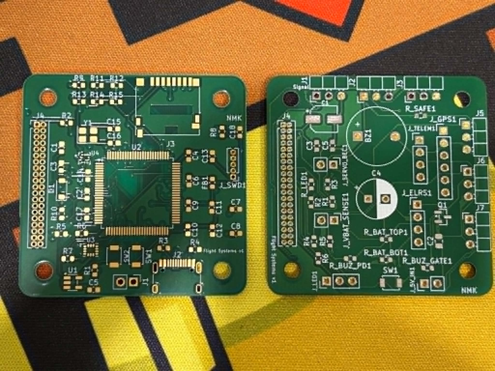
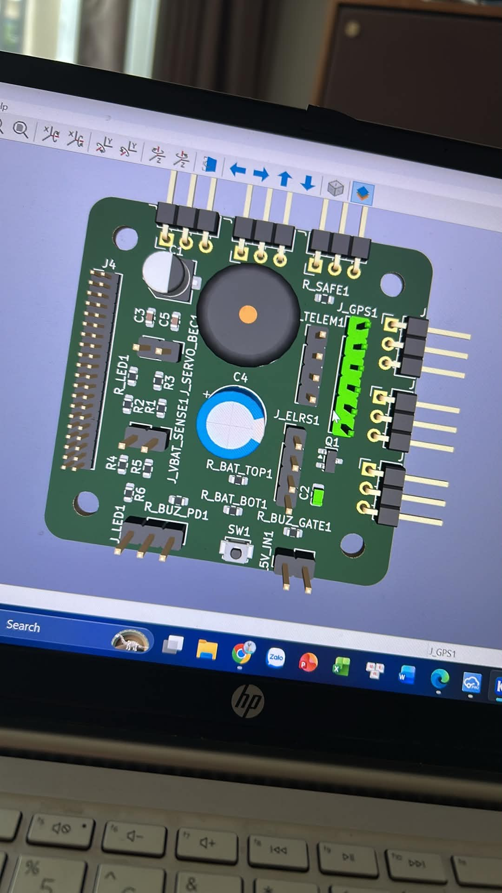
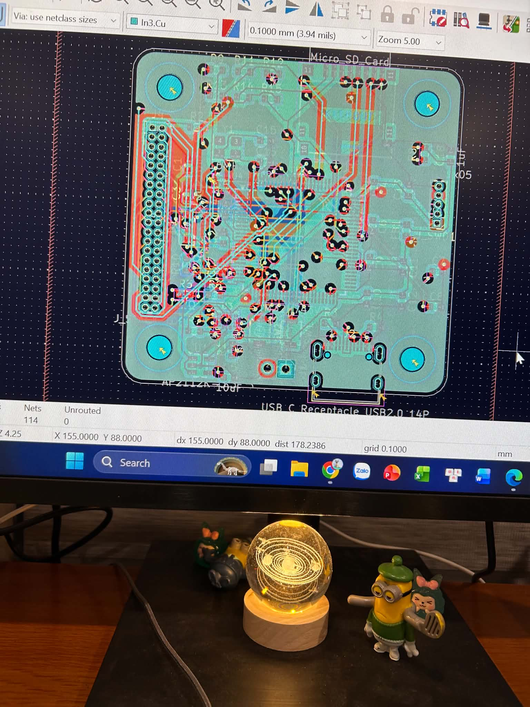
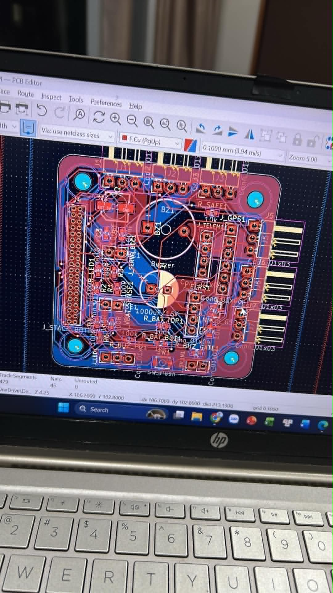
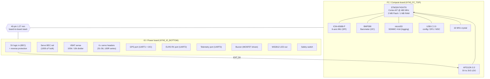

# H743 Flight Controller — *Flight Systems v1*

A compact, two-board **STM32H743** flight controller (FC) designed for a fixed-wing
/ multi-servo UAV. Built around a 480 MHz Cortex-M7, a high-performance IMU, a
barometer, onboard SD logging, and a full set of UAV peripheral ports (GPS,
ELRS, telemetry, up to 6 servo + 8 motor outputs).

Designed in **KiCad 9.0.7**. Hardware was split into two stacked boards to fit a
compact (~30 mm-class) footprint:

| Board | File | Role |
|-------|------|------|
| **FC / Compute** (top) | `H743_FC_TOP` | MCU, IMU, barometer, microSD, USB-C, clocking, 3V3 regulation |
| **IO / Power** (bottom) | `H743_IO_BOTTOM` | Power input/distribution, VBAT sense, servo headers, GPS/ELRS/telemetry ports, buzzer, LED, safety switch |

The two boards mate through a **40-pin, 1.27 mm board-to-board stack connector**.

---

## ⚠️ Project status — read this first

> **This is a hardware design project, not a finished product.**
>
> - ✅ Schematics complete (both boards)
> - ✅ PCB layout complete and routed (both boards)
> - ✅ Bare PCBs fabricated (photos below)
> - ❌ **NOT assembled** — no components soldered yet
> - ❌ **NOT powered on, NOT tested, NOT flown**
> - ❌ **No firmware written or ported yet**
>
> Nothing here has been electrically validated. Treat every value, footprint,
> and connection as **to-be-verified**. See [Known issues & things to verify](#known-issues--things-to-verify)
> before you order parts or build a board. **Do not fly an unvalidated autopilot.**

---

## Photos

| Fabricated boards (bare) | IO board 3D render |
|---|---|
|  |  |

| FC board layout (KiCad) | IO board layout (KiCad) |
|---|---|
|  |  |

Full-resolution schematics: [`docs/images/schematic-fc-top.png`](docs/images/schematic-fc-top.png) ·
[`docs/images/schematic-io-bottom.png`](docs/images/schematic-io-bottom.png)

---

## What it's designed to do

The board was specified to support a UAV that can:

- Log **altitude**, **attitude (tilt)**, and **GPS position**
- Drive up to **6 servos** for flight-surface control, stabilized from the IMU
- Be commanded from the ground over a radio link (ExpressLRS) + telemetry
- Fly **GPS waypoint missions** with autonomous attitude/throttle control

These are *design goals for the system*, realized in **firmware** — the hardware
provides the sensors, I/O and compute to make them possible. See
[Firmware](#firmware) for the realistic path to actually achieving them.

---

## System architecture



**Power philosophy:** logic 5V (from a BEC) feeds the FC's 3.3 V LDO through a
Schottky for back-feed protection. The **servo rail is separate** (its own BEC
into `J_SERVO_BEC`) so servo current spikes never disturb the MCU. Battery
voltage is read through a 100k/10k divider on `J_VBAT_SENSE`.

---

## Specifications

| Item | Detail |
|------|--------|
| MCU | STM32H743VIT6 — Cortex-M7 @ 480 MHz, 2 MB flash, 1 MB RAM, LQFP100 |
| IMU | ICM-42688-P, 6-axis, on SPI (CS/SCK/MISO/MOSI + 2 INT) |
| Barometer | BMP390, on I2C1 (addr 0x76, CSB tied high, INT unused) |
| Storage | microSD via SDMMC 4-bit (Hirose DM3D-SF footprint) |
| USB | USB-C 2.0 full-speed (HRO TYPE-C-31-M-12), 22 R series on D±, 5.1k CC |
| Clock | 16 MHz HSE crystal (3225), 18 pF load caps |
| Motor outputs | M1–M8 — TIM1 (PE9/11/13/15) + TIM4 (PD12–15) |
| Servo outputs | S1–S6 — TIM2/5 (PA0–PA3) + TIM3 (PB0–PB1), 100 R series |
| UARTs | GPS = USART1 (PA9/PA10), ELRS = USART2 (PD5/PD6), Telem = USART3 (PD8/PD9) |
| I2C | I2C1 (PB8/PB9) — onboard baro + external compass on GPS port |
| ADC | BAT_VOLT (PC0), BAT_CURR (PC1) |
| Power in | 5 V logic (BEC) + separate servo BEC rail + VBAT sense |
| Extras | Buzzer (2N7002 low-side), WS2812 LED, safety switch, CAN spare, RSSI spare |
| Stack | 40-pin 2×20, 1.27 mm board-to-board |
| Mounting | 4 × M3 (3.2 mm) corner holes |
| EDA | KiCad 9.0.7 |
| Nets | FC board ≈ 114 · IO board ≈ 46 |

> **STM32H743 note:** this is the same MCU class used by many ArduPilot/PX4
> autopilots, which is why the pin map below follows autopilot HAL conventions.

---

## Boards at a glance

### FC / Compute board (top)
Carries everything compute-and-sensor related: the H743, ICM-42688-P IMU on SPI,
BMP390 baro on I2C, microSD on SDMMC, USB-C, the 16 MHz crystal, BOOT/RESET
buttons, the SWD header, and the 5V→3V3 LDO. A **ferrite bead** splits a clean
`3V3_SENSOR` rail off `3V3_MAIN` for the IMU and baro.

### IO / Power board (bottom)
Carries everything that touches the outside world: the 5V logic input and servo
BEC input, the VBAT divider, the six servo headers (with 100 R series on the
signal lines), the GPS / ELRS / telemetry connectors, the MOSFET-driven buzzer,
the WS2812 LED output, and the safety-switch input.

➡️ **Full signal map:** see **[`docs/PINOUT.md`](docs/PINOUT.md)** — MCU pin
assignments, the 40-pin stack connector, and every external connector pinout.

---

## Repository structure

```
.
├── README.md                      ← you are here
├── docs/
│   ├── HARDWARE.md                ← detailed subsystem design + power tree
│   ├── PINOUT.md                  ← MCU pin map + stack + all connectors
│   ├── BOM.md                     ← bill of materials (both boards) + sourcing
│   └── images/                    ← board photos, layouts, full schematics
├── hardware/
│   ├── H743_FC_TOP.kicad_pro      ← KiCad project (FC board)
│   └── H743_IO_BOTTOM.kicad_pro   ← KiCad project (IO board)
└── .gitignore
```

> ℹ️ Only the `.kicad_pro` project files are included so far. To make this a
> reproducible KiCad project, also commit the **`.kicad_sch`** (schematic) and
> **`.kicad_pcb`** (layout) files for each board, plus any custom symbol/footprint
> libraries. Gerbers/drill files can go in a `hardware/production/` folder.

---

## Firmware

The hardware is a general-purpose H743 autopilot. There are two honest paths:

### Recommended: port an existing open-source autopilot
The intended features (EKF sensor fusion, attitude stabilization, GPS waypoint
missions, failsafes, RC + telemetry) represent **many years** of work to build
from scratch. The practical route is to **configure/port a mature flight stack**:

- **[ArduPilot](https://ardupilot.org/) (Plane)** — best fit for fixed-wing,
  servo-driven, GPS-waypoint flying. You'd write a board definition (`hwdef.dat`)
  mapping the pins below to ArduPilot's HAL, then build ArduPlane for it.
- **[PX4](https://px4.io/)** — similar capability; needs a board port.
- **[INAV](https://github.com/iNavFlight/inav)** — lighter, strong fixed-wing
  GPS/RTH support, friendlier to bring up than ArduPilot/PX4.

Good news: the pin map already lines up with autopilot conventions (8 motor +
6 servo timer outputs, dedicated UARTs for GPS/RC/telemetry, SDMMC logging,
SPI IMU, I2C baro+compass, VBAT divider, buzzer, LED, safety switch). This board
is a **natural ArduPilot/INAV target** — you write a target/board definition,
not a flight stack.

### Possible (for learning / non-flight use): bare-metal C++
You *can* program the H743 directly with **STM32CubeIDE / HAL / libopencm3** in
C++ — useful for bring-up tests (blink, IMU read, SD log, USB CDC) before
committing to a full stack. Hand-writing a complete autonomous flight controller
this way is not recommended for an actual aircraft.

### Not recommended: MicroPython for flight
MicroPython runs on the H743 and is great for ground experiments, but real-time
flight control loops and EKF are not a good fit for it. Keep Python on the
*ground-station* side.

---

## Bring-up & assembly

Don't power the assembled board straight from a battery on the first try. The
suggested order (full detail in [`docs/HARDWARE.md`](docs/HARDWARE.md)):

1. Solder and verify the **power section first** — confirm 3.3 V is clean and in
   spec **before** populating the MCU or sensors.
2. Populate the MCU, crystal, SWD header, USB. Confirm it enumerates / takes a
   SWD connection.
3. Add sensors (IMU, baro), microSD, then the IO board peripherals.
4. Bring up firmware incrementally (clock → USB → IMU → baro → SD → RC → servos).
5. **Bench-test servo/attitude response with props/linkages disconnected.**

A pre-power checklist is in [`docs/BOM.md`](docs/BOM.md) and [`docs/HARDWARE.md`](docs/HARDWARE.md).

---

## Bill of materials

Both boards' BOMs — with reference designators, values, **footprints**, quantities
and sourcing notes (the design targets parts available cheaply in Vietnam) — are in
**[`docs/BOM.md`](docs/BOM.md)**.

---

## Known issues & things to verify

Because nothing is tested yet, these are the highest-risk items to confirm:

1. **microSD footprint mismatch.** The PCB targets the Hirose **DM3D-SF**
   (push-pull, top-mount). A **DM3BT-DSF-PEJS** (push-push, reverse) is *not*
   pin-compatible — KiCad ships separate footprints. Buy the part that matches
   the footprint actually placed on the board.
2. **BMP390 must be the raw LGA-10 chip**, not a breakout module — a module won't
   land on footprint `U4`. Confirm availability before relying on it.
3. **Stack net-name inconsistency.** On the FC board, stack pins 7–14 are
   `M1–M8`; on the IO board the *same physical pins* are labelled `SPARE1–8`
   (the IO board doesn't break out motor outputs). Verify net continuity across
   the connector matches your intent before assembly.
4. **`VREF+` handling** on the H743 — confirm it's tied/decoupled appropriately
   for ADC accuracy (battery sensing).
5. **VBAT divider range.** 100k/10k = ÷11. Check it suits your battery cell count
   and ADC reference (use 1% resistors for accurate voltage).
6. **PCB stackup / layer count** — the editor shows inner copper layers; confirm
   the intended stackup (and impedance, if it matters for USB) with your fab.
7. **Servo BEC current** — `C4` (1000 µF) buffers the servo rail; size the BEC
   for your servos' stall current.
8. Everything else: this design has **never been powered**. Do a full DRC, a
   netlist cross-check against the schematic, and a careful visual review.

---

## Roadmap / TODO

- [ ] Commit full KiCad source (`.kicad_sch`, `.kicad_pcb`) + libraries
- [ ] Add Gerbers, drill files, and a fabrication/assembly drawing
- [ ] Resolve the [known issues](#known-issues--things-to-verify) above
- [ ] Assemble board #1 (power-first bring-up)
- [ ] Bring-up firmware (blink → USB → IMU → baro → SD → RC → servos)
- [ ] Choose flight stack (ArduPilot Plane / INAV) and write the board target
- [ ] Bench attitude-stabilization test (no props/linkages)
- [ ] Document calibration + first flight procedure

---

## Disclaimer

This is an experimental, **unvalidated** hardware project shared for learning and
documentation. There is **no warranty of any kind**. UAV autopilots can cause
injury or property damage if they malfunction. Do not fly hardware or firmware
that has not been thoroughly bench- and field-tested, never fly over people, and
**comply with your local UAV regulations** (in Vietnam, the CAAV rules) including
any registration, altitude, and no-fly-zone requirements. You assume all risk.

## License

No license is set yet — until one is added, default copyright applies (others
can view but not reuse). For an open-hardware project, common choices are
**CERN-OHL** (hardware) + **MIT/Apache-2.0** (firmware) or **CC-BY-4.0** for docs.
Add a `LICENSE` file to make your intent explicit.

## Acknowledgements

Built with [KiCad](https://www.kicad.org/). MCU and sensors by STMicroelectronics,
TDK InvenSense (ICM-42688-P), and Bosch (BMP390).

---

*Silkscreen: "Flight Systems v1".*
